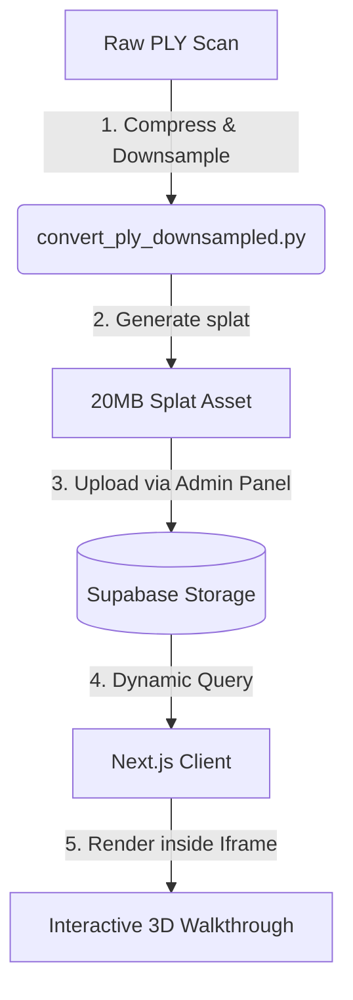

# 3D Walkthrough & Gaussian Splatting Integration

This document chronicles the implementation, optimization, configuration, and future roadmap of the **3D Walkthrough (Gaussian Splatting)** feature on the **abc-builders-madurai** client portfolio page.

---

## 1. 3D Walkthrough Core Integration
**Location:** `public/3d-viewer.html` & `src/components/ThreeDWalkthrough/embeds.json`

### The Technology (3DGS)
- Integrated **3D Gaussian Splatting (3DGS)** using Mark Kellogg's `@mkkellogg/gaussian-splats-3d` library over standard polygonal 3D meshes (like GLTF/OBJ) to provide photorealistic real-world scans of construction sites.
- Created a standalone WebGL-compatible rendering iframe in `public/3d-viewer.html` that handles the heavy rendering pipeline independently from the main Next.js app.

### Key Features of the Iframe Viewer:
- **Premium Loader:** A luxury dark-themed loading screen with a 1-100% progress indicator mapping the Splat download state.
- **Controls Hint Panel:** Overlaid floating hints detailing mouse/touch controls (Left Click = Rotate, Right Click = Pan, Scroll = Zoom).
- **Recenter Control:** A custom `🔄 Center View` button to return the camera to its calibrated starting coordinates.
- **Real-Time Debug Panel:** A toggleable developer panel (activated via `debug=true` query parameter) showing current real-time `Camera` and `Target` coordinates for easy visual calibration.

---

## 2. Performance & Delivery Optimization
**Location:** `convert_ply_downsampled.py` (Helper script in App Data)

### The File Size Challenge
- Raw `.ply` scans from scanning devices are extremely large (e.g., `building.ply` was **310.5 MB**), which causes browser crashes, slow download times on mobile connections, and Git/Vercel deployment upload timeouts (HTTP 408/Connection Reset).

### The Downsampling Solution
- Developed a custom Python conversion script that compiles binary little-endian `.ply` point clouds into packed binary `.splat` files.
- Implemented **50% downsampling** (taking every 2nd vertex) during compilation:
  - **Project 2 (HMS Colony):** Reduced points from **1,313,015** to **656,507**.
  - **File Size:** Compressed from **310.5 MB** (PLY) to **20.03 MB** (SPLAT).
  - **Quality Preservation:** The visual fidelity remains indistinguishable on mobile and web screens, while FPS (frame-rate) is dramatically improved on standard mobile GPUs.
  - **Upload Stability:** Allowed git pushes and Vercel direct deployments to complete instantly.

---

## 3. Hydration & UX Optimization
**Location:** `src/app/[locale]/projects/page.tsx`

### Issue Addressed
- Rendering the WebGL viewer iframe and Pannellum canvas container immediately inside the project modal (even when hidden on default "Visualisation vs Reality" slider tab) caused hydration mismatches, WebGL initialization errors on invisible DOM nodes, and browser crashes, leading to a blank white screen.

### Lazy Loading & Client-Side Caching:
- Introduced two state flags: `hasLoaded360` and `hasLoaded3d` (both defaulting to `false`).
- Wrapped the 3D walkthrough and 360 virtual tour components in logical guards:
  - **Modal Open:** Only the light Before/After slider renders. WebGL is completely unmounted (0% CPU/GPU overhead).
  - **Tab Switch:** When a tab is first clicked, the respective state is set to `true`, mounting the component.
  - **DOM Caching:** Once a tab is loaded, it remains mounted in the DOM (`opacity-0` absolute positioning when inactive). If the user switches away and returns, the viewer is instantly visible with **0% reload delay** and state preserved!
  - **Modal Close Reset:** Both states reset to `false` when `selectedProject` changes or closes, cleaning up memory.

---

## 4. Calibration & Coordinates Settings
**Location:** `src/components/ThreeDWalkthrough/embeds.json`

To counteract coordinate axis inversion (Z-up vs Y-up) and roll tilts caused by phone angles during scanning, we calibrated the starting positions and scene rotations:

### A. The Hero Residence (Project 1 - Room)
- **Scene Rotation:** `0,0,168` (flips upright and applies a 12-degree clockwise Z-rotation to level the tilted floor).
- **Camera Position:** `-1.209, 0.5, 4.0` (raised view to look slightly down).
- **Camera LookAt (Target):** `-1.209, -1.0, -0.156` (perfectly centered).

### B. HMS Colony (Project 2 - Building)
- **Scene Rotation:** `0,0,168` (corrects the tilted roll scan).
- **Camera Position:** `-0.471, 0.5, 6.0` (positioned 6 meters back to frame the entire building).
- **Camera LookAt (Target):** `-0.471, -1.0, 1.661` (centered on building entry).

---

## 5. Future Roadmap

### 1. Database-Driven Embeds (Supabase)
- Transition the `embeds.json` static configuration into a Supabase database table (e.g., `walkthrough_embeds`).
- Dynamically query parameters (`cameraPosition`, `cameraLookAt`, `sceneRotation`) on modal load based on project IDs.

### 2. Admin Dashboard Configuration Tool
- Create a configuration panel in `tourpro-admin` where administrators can:
  - Upload raw `.ply` or `.splat` files to Supabase bucket storage.
  - Load the viewer in "Edit Mode" with the debug panel visible.
  - Manually rotate/move the camera to the perfect starting angle.
  - Click a "Save Starting Angle" button, which directly updates the database record.

### 3. Integrated Splat Editors
- Integrate **PlayCanvas SuperSplat** web editor instructions into the admin workflow to allow administrators to crop outliers, delete ceiling/floor noise, and align axes before uploading assets.
